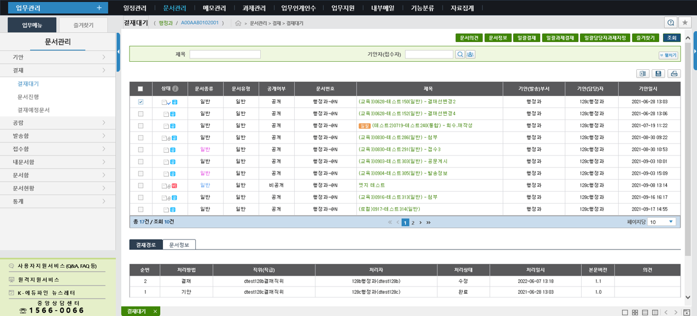

<!--
<figure markdown="span">
  
</figure>
-->

#:books: 업무관리 지식기반 

K-에듀파인 업무관리는 17개 시·도교육청과 산하기관, 1만 2천여 개의 초 ·중 ·고등학교 등에 소속된 약 70만여 명의 교직원의 행정업무에 필수적으로 사용되고 있습니다. 사용자에게 업무관리에 대한 기능을 효율적으로 안내하고자 ==**현재 온라인 지식기반을 개발중에 있습니다.**== :octicons-heart-fill-24:{ .heart }

<figure markdown="span">
  
  <figcaption>K-에듀파인 업무관리 사용자 화면</figcaption>
</figure>

##:material-download: 지식기반 다운로드 방법

